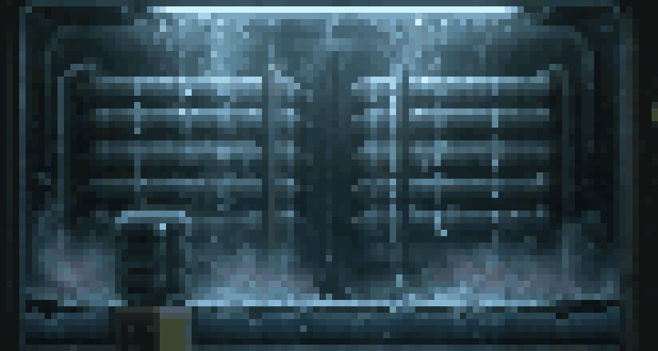

# COND-07 reservoir and drops

From the repository root, run `zig build condenser-demo`. It opens the actual
layered condenser artwork with water in the bottom basin, five accelerating drop
streams, localized fading ripples, subtle supplied reflections and separate mist.
Close the window to exit. No assembler checkout or asset-directory setup is needed;
the PNGs from the assets PR #106 are embedded in the executable.



This preview is a 72-frame GPU capture at 30 simulation fps, default 80% fill
and 8x integer scale. It shows the authored working canvas rather than the
full-resolution reference plate.

The example is backend-direct: it exercises the shipped BGFX pixel-water material,
not an engine `PixelWater` component. It does not close every acceptance item in
issue #100. Mobile/browser engine integration remains separate.

## Capture and tune

```sh
zig build condenser-capture -Dcondenser-time=1.4
zig build condenser-capture -Dcondenser-time=0 -Dcondenser-frames=72
zig build condenser-demo -Dcondenser-level=0.6 -Dcondenser-scale=6
python3 test/condenser_capture.py
```

Single captures write `zig-out/condenser.tga`. Sequences write numbered TGAs in
`zig-out/condenser-frames/`, at 30 simulation frames/second; each invocation writes
only the requested indices, so use those indices when making a movie. A scale of
1 renders the 103x55 working canvas; the default integer enlargement is 8.
`-Dcondenser-fallback=true` draws the authored static reservoir as a negative
control while preserving mist and drop animation. Unsupported water also falls
back during interactive play; the regular capture fails rather than accepting it.

The verification script checks deterministic repeat captures, moving water vs a
static-water control, the cooler's foreground occlusion, bounds, independent fill,
and identical pixels at 1x and nearest-neighbour 8x. Timing/contact/expiry tests
run in `zig build test`. `-Dgamepad_enabled=false` can be used when SDL2 is not
installed; this scene does not use gamepads.

## Coordinates and layering

The supplied assets use a 103x55 working canvas. The basin is x=4, y=48, w=93,
h=6, and measured emitters are x=25/32/47/55/69. The reservoir art and mask are
cropped to the basin before upload, so the shader's fill level, reflection and
impact coordinates are basin-local. The five impacts fit within the material's
eight-entry limit. Drop timing and impact creation share a deterministic clock;
sampling a late frame preserves contacts without replaying frame-dependent events.
The visible contact plane follows the shader's quantized waves and active ripples.

Draw order is interior → water → mist → drops/splash glints → cooler → frame.
Sequential BGFX submission preserves that ordering across the sprite, flat and
water programs. All art uses point sampling. Water settings and timing live in
`src/condenser_scene.zig` and `src/condenser_sim.zig`; mist uses its own period.

The water is deliberately restrained because the basin is only six working rows
tall. The 6-pixel reference overlay motivated this working canvas; it is not a
native grid recovered from the full-resolution artwork. The supplied reflection,
hidden mask and mist separation are reconstructed assets. The tiny splash glints
are authored, since the reference contains no impact frames. See the asset README
for the measured vs reconstructed distinctions.
