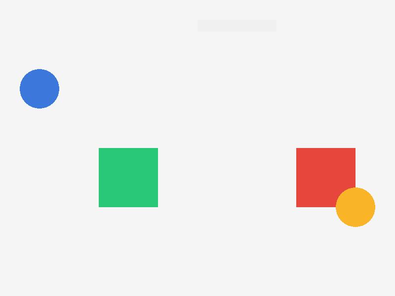

# example_bgfx_splitscreen — 2-camera split-screen on bgfx

Proves **simultaneous N-camera split-screen** on the real **bgfx** backend
(labelle-bgfx#51). Two authored `Camera` entities each own a half-screen
viewport and look at a **different** world region; both halves render in the
**same frame**, each to its own bgfx view id.



- **Left half** (`main` camera, world x≈400): green square + blue circle.
- **Right half** (`p2` camera, world x≈2400): red square + orange circle.
- **Top centre**: a pinned `hud` screen layer drawing full-window over both
  halves (the full-window segment path).

Captured headless/surfaceless on the bgfx Metal offscreen framebuffer via
`LABELLE_SCREENSHOT_PATH` — no window, no display server.

## How it works

Before #51 every gfx draw shared bgfx **view 0**, whose rect is whatever was
set LAST — so with N cameras the last camera's viewport won and the halves
collapsed into one region. #51 gives **each per-camera viewport pass its own
transient bgfx view** (rect + scissor), so N cameras compose simultaneously.

The split is authored purely declaratively:

```jsonc
// scenes/main.jsonc
{ "name": "camera_p1", "components": {
    "Position": { "x": 400, "y": 300 },
    "Camera": { "tag": "main", "viewport": { "x": 0, "y": 0, "width": 400, "height": 600 } } } }
{ "name": "camera_p2", "components": {
    "Position": { "x": 2400, "y": 300 },
    "Camera": { "tag": "p2", "viewport": { "x": 400, "y": 0, "width": 400, "height": 600 } } } }
```

```zig
// project.labelle — a layer per camera tag
.layers = .{
    .{ .name = "p1_world", .order = 0, .space = .world },              // → "main"
    .{ .name = "p2_world", .order = 1, .space = .world, .camera = "p2" },
    .{ .name = "hud",      .order = 2, .space = .screen },             // pinned, full-window
},
```

## Run

```bash
labelle run                                      # windowed
LABELLE_SCREENSHOT_PATH=$PWD/screenshots/shot \
  labelle run --timeout=6s                       # headless capture → shot.tga
```

## Post-fx interaction (v1)

Post-fx is **whole-frame** in v1: when the post-fx driver captures the scene
into its ping-pong render target, per-camera viewport rects scope that render
target rather than the backbuffer, so a single camera composes correctly under
post-fx while N-camera split-screen under an **active post-fx stack** keeps the
pre-#51 whole-frame behaviour. Per-camera post-fx is a deliberate follow-up.
