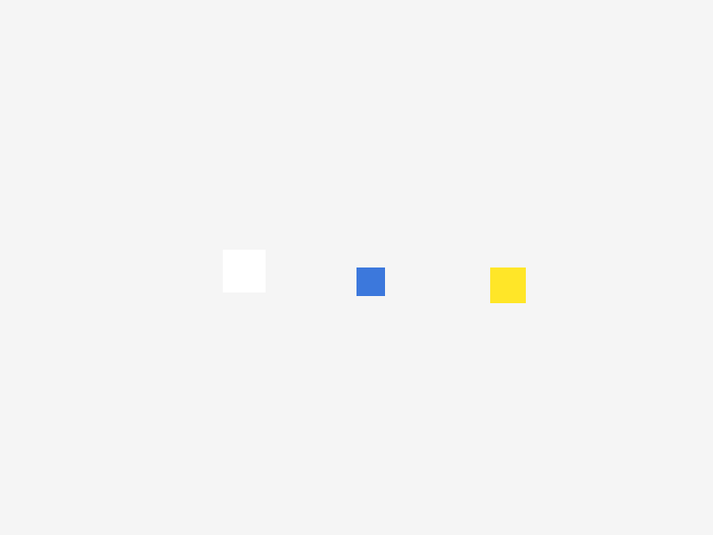
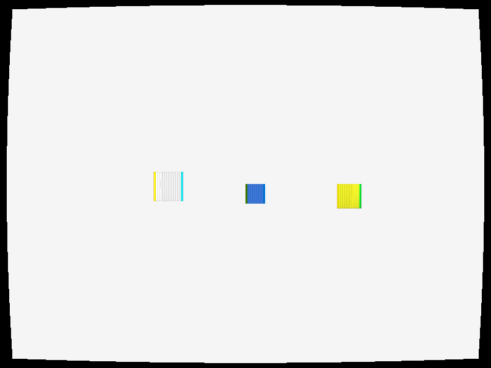
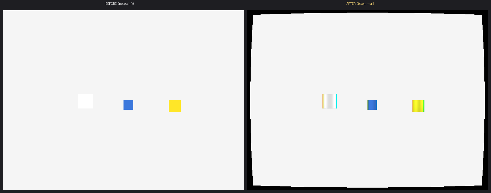

# example_bgfx — declarative post-fx on the bgfx backend

A minimal LaBelle v2 game that showcases the declarative `project.labelle`
**`.post_fx`** feature (labelle-gfx#305 Phase 2) rendering on the real **bgfx**
backend. The scene draws three bright screen-space rectangles; the `.post_fx`
block stacks a **bloom** pass and a **CRT** pass over the whole frame.

## Before / after

| Without `.post_fx` | With `.post_fx` (bloom + crt) |
|---|---|
|  |  |



The "after" capture shows the CRT pass's **barrel curvature** (the rounded,
black-bordered screen), **scanlines**, and **chromatic aberration** (the cyan /
green channel fringing on the shape edges), plus the bloom pass lifting the
bright shapes. Both frames were captured **fully headless / surfaceless** on the
bgfx Metal offscreen framebuffer (`initHeadless`, bgfx#36) — no window, no
display server.

## The `.post_fx` block

```zig
// project.labelle
.post_fx = .{
    .{ .bloom = .{ .threshold = 0.75, .intensity = 1.4, .radius = 1.5 } },
    .{ .crt   = .{ .curvature = 0.12, .scanline = 0.5, .mask = 0.3, .aberration = 0.004 } },
},
```

Passes render top-to-bottom (bloom first, then crt). The pipeline is:

```
project.labelle .post_fx
  └─ assembler (>= 0.80.0)  → emits `if (@hasDecl(...,"setPostFx")) g.setPostFx(&.{ … })`
       └─ engine (>= 2.4.0) → Game.setPostFx forwards to gfx's PostFxDriver
            └─ gfx (>= 1.28.0) PostFxDriver → per-pass `applyPostPass`
                 └─ bgfx (>= 0.11.0)        → fs_bloom / fs_crt shaders (offscreen ping-pong → composite)
```

### Friendly params

Each pass takes artist-friendly floats; the assembler maps them onto the
backend `PostPassUniforms` slots (RFC-MATERIAL-POSTFX §2.2):

| Pass | Params |
|------|--------|
| `bloom` | `threshold` (luminance cut-off to glow), `intensity` (glow strength), `radius` (blur spread) |
| `vignette` | `intensity`, `radius`, `softness`, `tint` (`[3]f32`) |
| `color_grade` | `strength`, `lut` (LUT texture id) |
| `crt` | `curvature` (barrel amount), `scanline` (line darkness), `mask` (shadow-mask strength), `aberration` (channel-split px) |

bgfx implements `bloom`, `vignette`, `color_grade`, and `crt`; a pass a backend
does not implement degrades to a pass-through (no crash).

## Building / running

The example is wired for the standard monorepo dev layout (sibling checkouts of
`labelle-cli` / `labelle-assembler`, and the bgfx backend resolved from this
repo via `local:../..`):

```bash
labelle build          # generate + zig build (bgfx, Metal on macOS)
labelle run            # + run
# Headless capture (surfaceless — works with no display):
labelle run --headless --screenshot=$(pwd)/screenshots/with_postfx --ticks=30
# writes screenshots/with_postfx.tga (bgfx captures TGA; convert to PNG as desired)
```

Pins (see `project.labelle` / `labelle.lock`): core **1.26.0**, engine **2.4.0**,
gfx **1.28.0**, assembler **>= 0.80.0**, backend (this repo) **>= 0.11.0**.

## Note on the engine render path (gfx wiring)

The declarative `.post_fx` stack reaches the framebuffer via the engine's
**camera-aware** render path (`GfxRenderer.renderWithLayerHooks`). In the shipped
**gfx 1.28.0** the `PostFxDriver.begin` / `.resolve` calls are wired only into
the retained engine's *standalone* `render()`, which that camera-aware path does
**not** call — so the passes need `renderWithLayerHooks` to wrap its layer loop
with `post_fx.begin/resolve` (a small, behavior-preserving gfx fix — no-op when
the stack is empty). The screenshots here were produced with that fix applied;
the runtime API, assembler codegen, shaders, and headless driver seam are all
otherwise exercised end-to-end. See the bgfx repo's `zig build post-fx-golden`
and `post-fx-integration-golden` steps for the headless driver goldens.

## Scene format

`scenes/main.jsonc` uses the **unified** scene format (engine v2.0): file-level
entities live under the flat top-level `"children"` array — the legacy
`"entities"` key was removed in engine v2.0.0 (#592). The shapes sit on a
**screen-space** layer (`hud`) so they render without an authored camera.
